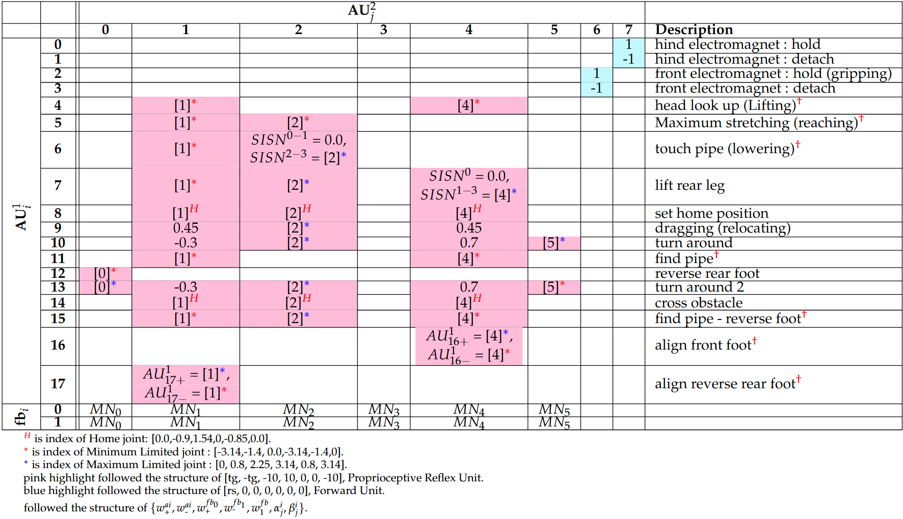

# Inchworm-inspired Adaptive Multimodal Neural Control (IAMNC) for Autonomous Locomotion and Gait Transition of a Bipedal Out-pipe Inspection Robot

<!--  -->

## Adstract
While inspection robots currently achieve autonomous locomotion and transitions using computationally expensive multi-dimensional data, such as point cloud map, invertebrates, like inchworms, can navigate complex tree branches effortlessly with a simple brain and little information. Inspired by this, this work presents an Inchworm-inspired Adaptive Multimodal Neural Control (IAMNC) that employed merely nine exteroceptive sensors to achieve autonomous locomotion and gait transition. The IAMNC consists of three interpretable modules: Mode Selection (MoSe) for autonomous mode selection, Locomotion Control (LoCo) for adaptive crawling, and Transition Control (TraCo) for adaptive transitions. Additionally, this work also proposes interpretable Adaption Units (AU), which can be configured to obtain different functions (e.g., reflex, memory, and logic gate operations). Thus, connecting them as an Adaptation Unit Network (AUN) resulting in complex yet understandable adaptation signals for autonomous and stable gait transitions. With this control approach, a physical bipedal out-pipe inspection robot demonstrates autonomous locomotion, gait transitions, and adaptation across various pipe connection types. It can also autonomously step over an obstacle on the pipe, relying on seven infrared obstacle detection sensors and two indective sensors, rather than a computationally expensive camera sensor. Therefore, this work highlights the use of minimal sensors with neural control to ease computation as well as the importance of bio-inspiration in robotics.

***
## Hardware
**__AVIS-II BIPEDAL OUT-PIPE INSPECTION ROBOT__**

<!--  -->

The AdVance pipe Inspection robot System-II (AVIS-II), it is an upgrade of the previous version <a href="#zavis">[1]</a>. The robot structure is made of aluminum, while the cover are made of PLA plastic. It has six revolute joints, driven by XM540-W270-R Dynamixel servo motors at the joints M1, M2, M4 and XM430-W350-R Dynamixel servo motors at joints M0, M3, M5. It uses two electromagnets (Magma-4230035) installed at its feet to attach metal pipes with two 3D printed ABS foot caps and silicone rings for improved stability and adhesion.

The robot was equipped with 16 input signals in total. Seven signals are proprioceptive information. A roll signal from an inertia measurement unit (IMU) is used for locomotion with adaptive balancing and six motor position signals for low-level motor position control (Section III-B and Section III-C).

Other nine signals are exteroceptive information, divided into two types. Three frontal infrared sensors ($IR_{0−2}$) in the front are for detecting obstacle located in the front, being the analogy of the inchworm’s simple visual feedback. Thus, they are used to classify operating pipe conditions/modes (Section III-A). Apart from that, four infrared sensors ($IR_{3−6}$) at the feet and two inductive sensors ($IND_{0−1}$) beneath the feet are for foot alignment and surface detection, being the analogy of the inchworm’s feet haptic feedback. Thus, they are used to generate inchworm-inspired adaptive actions (Section III-C).

***
## Demonstration video of the robot using inchworm-inspired adaptive multimodal neural control (IAMNC)

<!-- (https://youtu.be/H5cYFxIEegE) -->
<!-- 

  

 -->

Click the image or Link: https://youtu.be/H5cYFxIEegE

***
## SUPPLEMENTARY MATERIALS
### Table S1: Weight connection between Sensor feedbacks and $IPN$ network
Connection wight between Sensor feedbacks and IPN network ($W^{\vec{ipn}}_{\vec{fb}}$).

---
### Table S2: Weight connection $(W_A)$ between $SISN$ and $IPN$ network.
- (Table S2.1) Connection wight between $SISN^0$ and $IPN$ network.

- (Table S2.2) Connection wight between $SISN^1$ and $IPN$ network.

- (Table S2.3) Connection wight between $SISN^2$ and $IPN$ network.

- (Table S2.4) Connection wight between $SISN^3$ and $IPN$ network.

Note: no connection means no adaptive action in th sequenctial action.

---
### Table 3: Weight connection $(W_B)$ between $SISN^{0-3}$ and $AU^0$ network.
- (Table S3.1) Connection weight between $SISN^0$ and $AU^0$ network.

- (Table S3.2) Connection weight between $SISN^1$ and $AU^0$ network.

- (Table S3.3) Connection weight between $SISN^2$ and $AU^0$ network.

- (Table S3.4) Connection weight between $SISN^3$ and $AU^0$ network.

---
### Table 4: Summary five different $AU$ modes and functions.
five different $AU$ modes, presented along with their activation functions, inputs, parameters, functions, and where they are employed in the $AUN$. $x[t]$ denotes the input signal (e.g., from the previous layer), $ir_m$ denotes the $m^\text{th}$ IR distance feedback, and $mn_k[t-1]$ denotes the $k^\text{th}$ target motor position at previous timestep. $rs$ denotes a scaling parameter, $en$ denotes enabling connection weights, and $ae$ denotes the parameter corresponding to an acceptable threshold.

---
### Table 5: Weight connection of Adaptation Unit Network between layer $(AU^{0-4})$
- (Table S5.1) Connection weight $(W_C)$ between $AU^0$ and $AU^1$ network.

- (Table S5.2) Connection weight $(W_D)$ between $AU^1$ and $AU^2$ network.

- (Table S5.3) Connection weight $(W_E)$ between $AU^2$ and $AU^3$ network.

- (Table S5.4) Connection weight $(W^{rs}_E)$ between $AU^0$ and $AU^3$ network

- (Table S5.5) Connection weight $(W_F)$ between $AU^3$ and $AU^4$ network.

***
## Comparison of Eight State-Of-The-Art Robots.
Comparison of eight state-of-the-art robots, including the presented AVIS-II, in terms of their weights, sizes, control approaches, the number of exteroceptive inputs along with their dimensions, and demonstrated transition conditions along with their cost of transport (COT).

<!--  -->

***
## REFERENCES

<a id="zavis">[1]</a> . Srisuchinnawong, K. Phongaksorn, W. Ausrivong, and P. Manoonpong, “Adaptive bipedal robot walking on industrial pipes under neural multimodal locomotion control: Toward robotic out-pipe inspection,” IEEE/ASME Transactions on Mechatronics, 2023.
